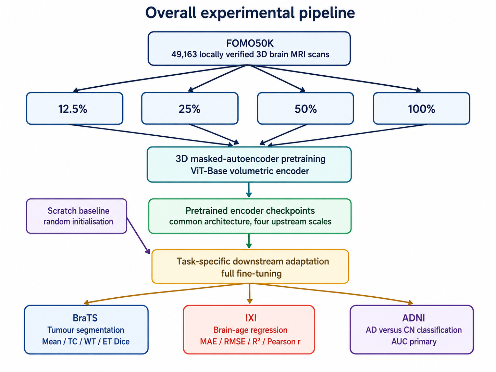
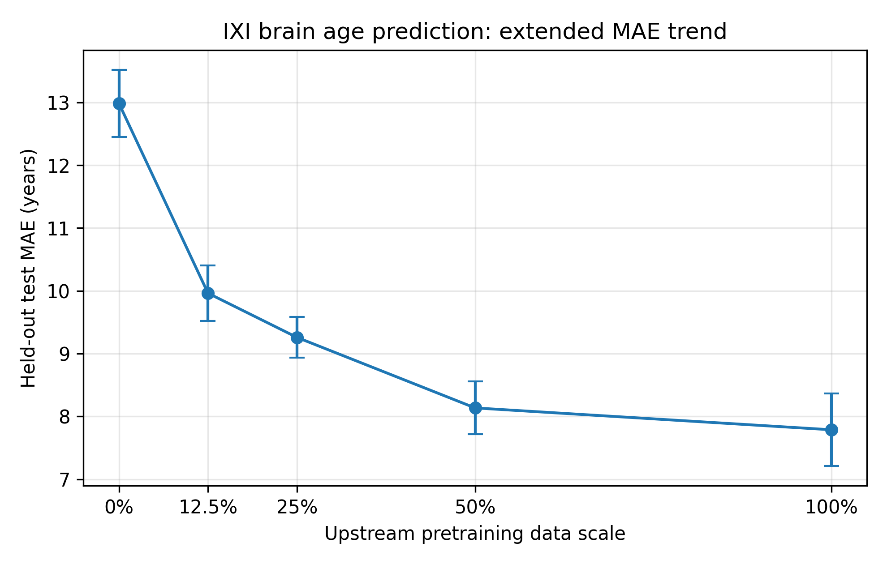

# Data-Efficient Pretraining of 3D Foundation Models for Brain MRI

A research project investigating how the amount of upstream self-supervised pretraining data affects transfer across heterogeneous 3D brain MRI tasks.

This work was conducted as part of my MSc in Artificial Intelligence for Biomedicine and Healthcare at University College London.

  

## Research Question

How does increasing the amount of upstream self-supervised brain MRI data affect downstream transfer, and is the relationship consistent across different medical imaging tasks?

## Approach

I investigated data-efficient pretraining using a 3D masked autoencoder with a ViT-Base encoder.

The upstream pretraining corpus was divided into nested fractions:

- 12.5%
- 25%
- 50%
- 100%

The architecture, self-supervised objective, preprocessing framework, and nominal pretraining schedule were kept fixed so that downstream differences could primarily be interpreted in terms of upstream data scale.

The pretrained encoder was subsequently transferred to three downstream brain MRI tasks.

## Downstream Tasks

### IXI Brain-Age Prediction
Regression from structural T1-weighted MRI to chronological age.

### ADNI Alzheimer's Disease Classification
Binary classification between Alzheimer's disease and cognitively normal subjects.

### BraTS Brain Tumour Segmentation
Voxel-level segmentation of tumour core, whole tumour, and enhancing tumour.

Together, these experiments evaluate transfer across regression, classification, and dense segmentation.

## Selected Result

The clearest pretraining-scale relationship was observed for IXI brain-age prediction.

| Pretraining | Test MAE (years) |
|---|---:|
| Scratch | 12.98 ± 0.53 |
| 12.5% | 9.96 ± 0.44 |
| 25% | 9.26 ± 0.32 |
| 50% | 8.14 ± 0.42 |
| 100% | **7.79 ± 0.58** |

Using the full upstream pretraining set reduced mean absolute error by approximately 40% relative to training the same downstream architecture from scratch.

  

Results on ADNI classification and BraTS segmentation were more task- and adaptation-dependent, suggesting that increasing upstream pretraining scale does not necessarily produce uniform downstream improvements.

## Technical Overview

- 3D masked autoencoder pretraining
- ViT-Base encoder
- 96 × 96 × 96 MRI input volumes
- 16 × 16 × 16 patches
- 75% masking ratio
- Nested upstream data fractions
- Transfer learning across regression, classification, and segmentation
- Cross-validation and convergence analysis

